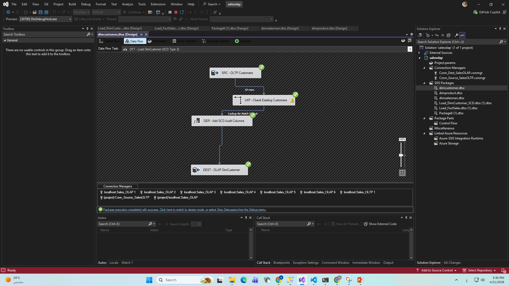
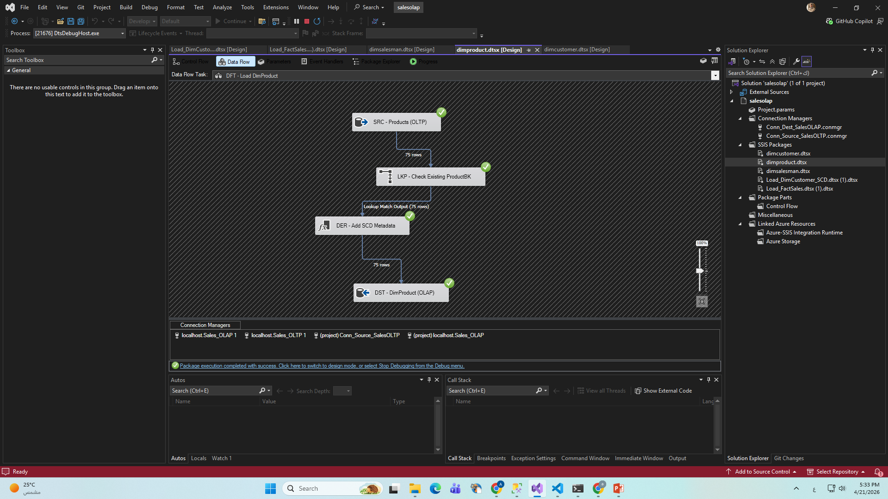
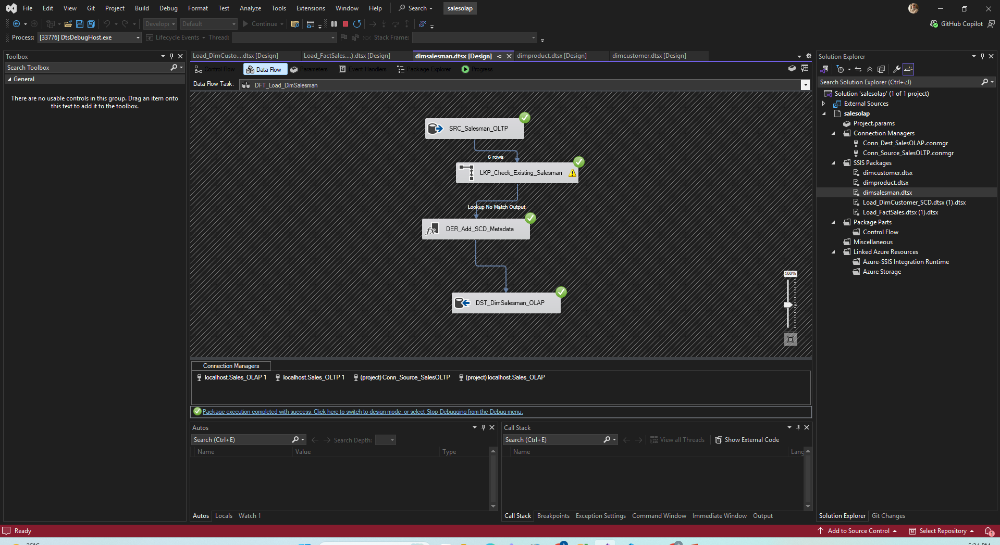

# Smart Electricity Monitoring - ETL Pipeline ⚡

This project implements a robust ETL process using **SQL Server Integration Services (SSIS)** to manage and monitor electricity data, ensuring a reliable data warehouse for analysis.

## 🚀 Project Overview
The pipeline handles data extraction, transformation, and loading (ETL) from source systems into a Central Data Warehouse. It includes advanced data engineering techniques like **SCD Type 2** for historical tracking.

## 🛠️ Tech Stack
* **ETL Tool:** SQL Server Integration Services (SSIS)
* **Database:** Microsoft SQL Server
* **Data Modeling:** Star Schema (Facts & Dimensions)

## 📊 Pipeline Visuals

### 1. Control Flow (Main Workflow)
This is the master orchestration of the ETL process.

### 2. Data Flow Implementations
Detailed logic for loading various tables:

| Table | Description | Data Flow Preview |
| :--- | :--- | :--- |
| **DimCustomer** | Handles customer data with **SCD Type 2** |  |
| **DimProduct** | Loads product categories and details |  |
| **DimSalesman** | Manages sales representative data |  |
| **FactSales** | The core transaction table load |  |

## ✅ Key Features
* **Slowly Changing Dimension (SCD Type 2):** To maintain history of customer changes.
* **Lookup Transformations:** To ensure data integrity between dimensions and facts.
* **Automated Error Handling:** Ensuring the pipeline is "Self-Healing" and robust.
